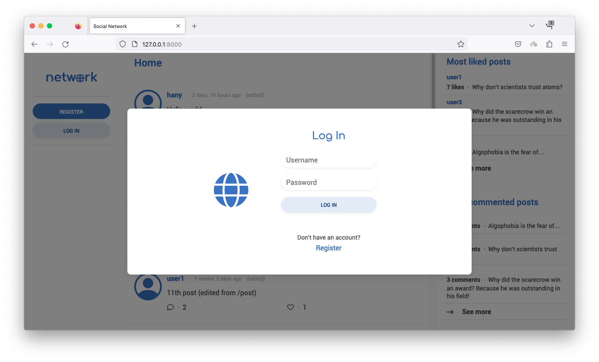
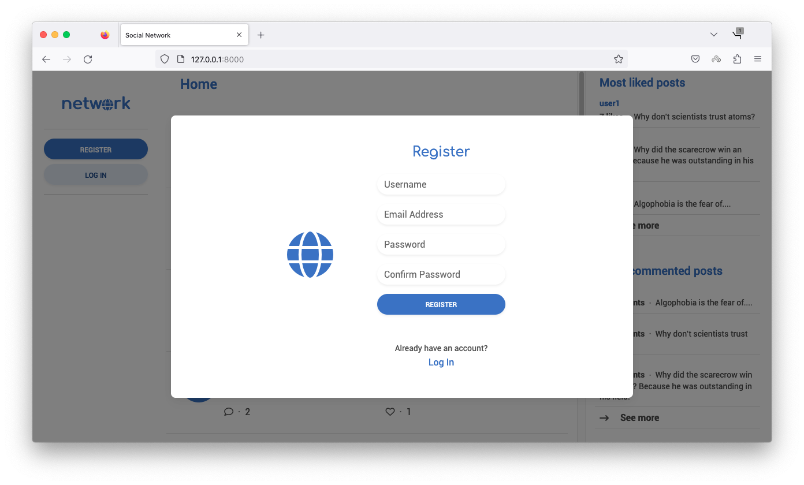
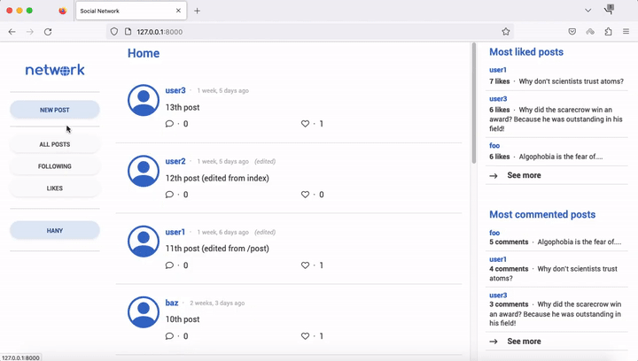
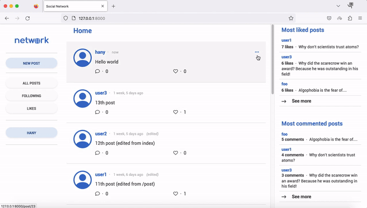
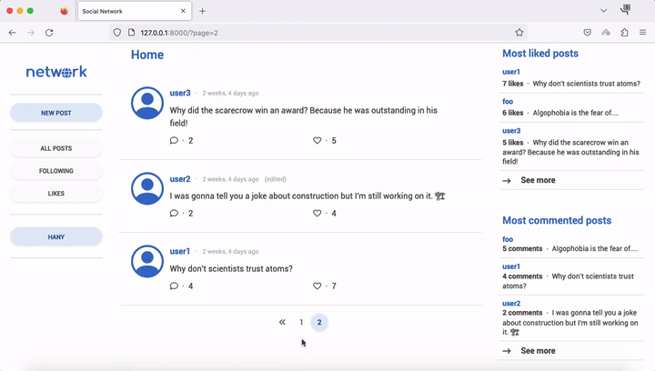
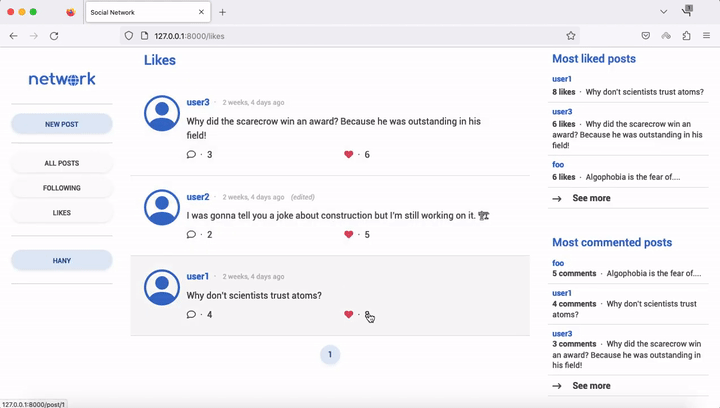
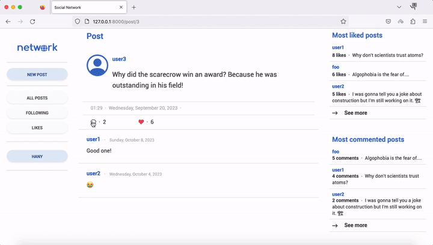
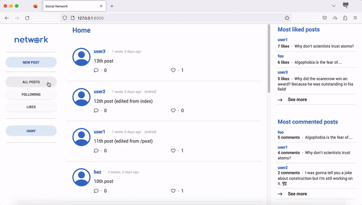
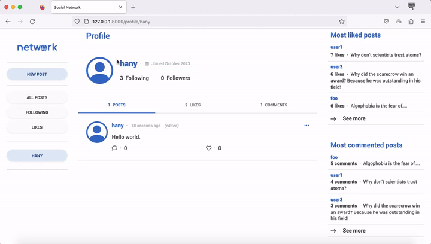

# Network
### [Video Demo](https://youtu.be/BL0ik9EYlYw)
### Description: A Twitter-like social network website for making posts and following users.
# Specification
1. Log in and register user.

2. New post: Users who are signed in should be able to write a new text-based post by filling in text into a text area and then clicking a button to submit the post.  

3. Edit Post: Users should be able to click an “Edit” button or link on any of their own posts to edit that post.  

4. “Like” and “Unlike”: Users should be able to click a button or link on any post to toggle whether or not they “like” that post.  

5. Comment on a post: User should be able to leave comments on any post.  

5. All Posts: The “All Posts” link in the navigation bar should take the user to a page where they can see all posts from all users, with the most recent posts first. 
6. Pagination: On any page that displays posts, posts should only be displayed 10 on a page. If there are more than ten posts, a “Next” button should appear to take the user to the next page of posts (which should be older than the current page of posts). If not on the first page, a “Previous” button should appear to take the user to the previous page of posts as well.  

7. Following: The “Following” link in the navigation bar should take the user to a page where they see all posts made by users that the current user follows.  

8. Profile Page: Clicking on a username should load that user’s profile page. This page should:
    - Display the number of followers the user has, as well as the number of people that the user follows.
    - Display all of the posts for that user, in reverse chronological order.
    - For any other user who is signed in, this page should also display a “Follow” or “Unfollow” button that will let the current user toggle whether or not they are following this user’s posts. Note that this only applies to any “other” user: a user should not be able to follow themselves. 
